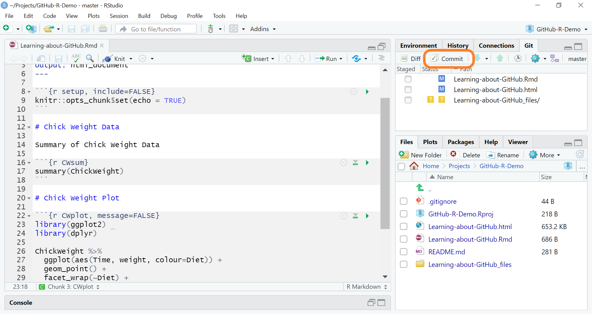
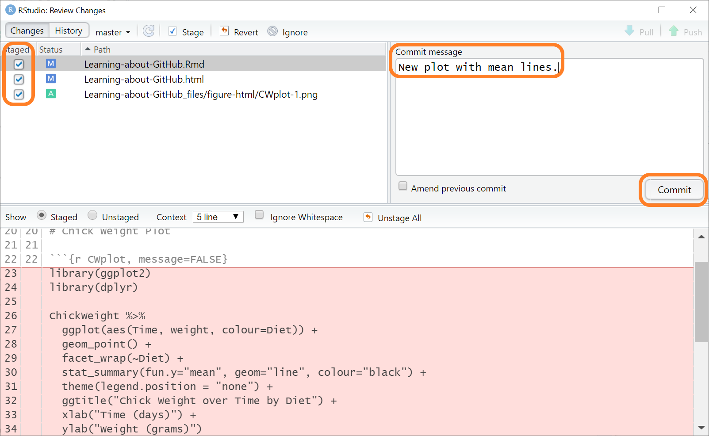
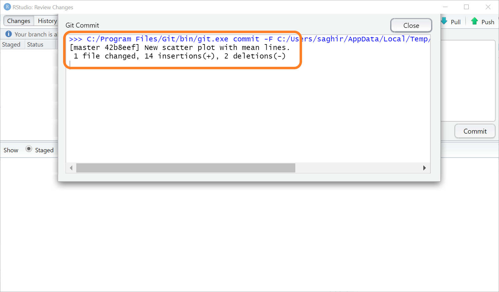
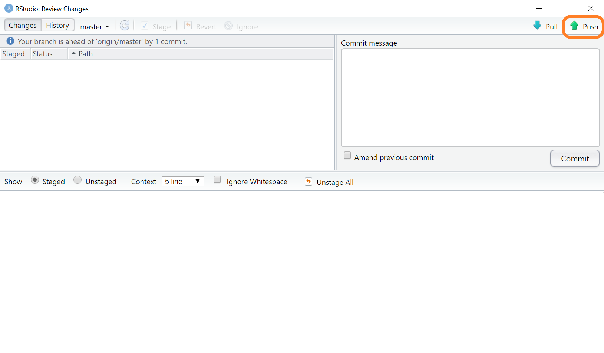
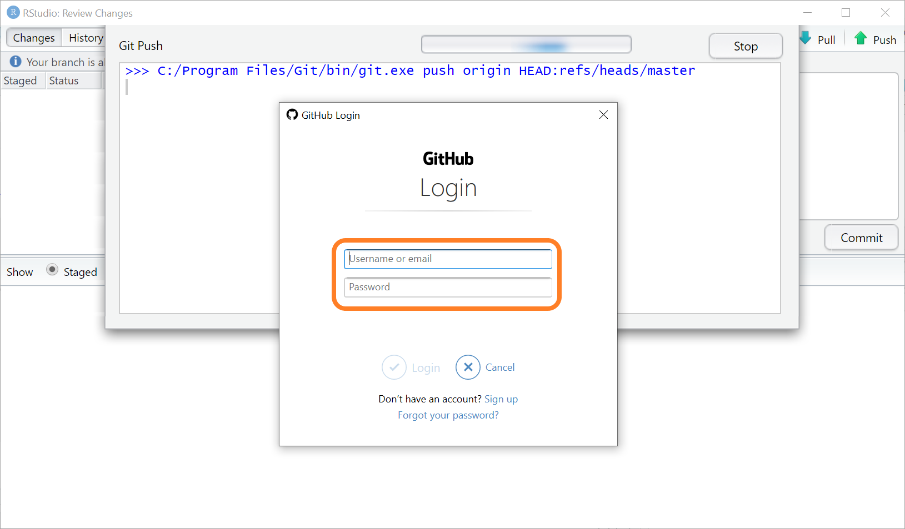
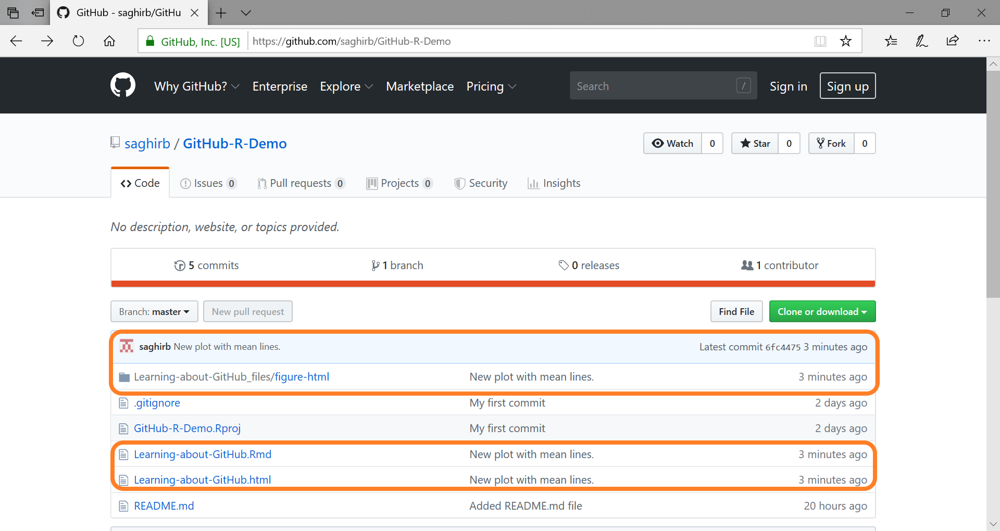
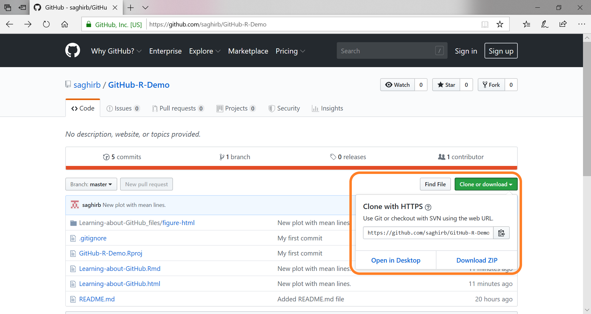
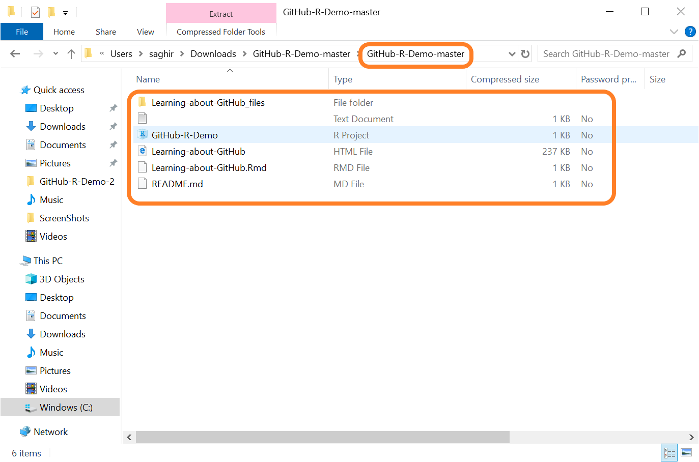

```{r setup, include=FALSE}
library(here)
library(knitr)
library(kableExtra)

# Copied & modified from: https://github.com/gadenbuie/gentle-ggplot2 (Index.Rmd)
#
# Thanks to Garrick Aden-Buie (https://www.garrickadenbuie.com/) for sharing :)
#

knitr::opts_chunk$set(fig.width=4.4, fig.height=3.2, fig.retina=4,
                      out.width = "100%",
                      message=FALSE, warning=FALSE, cache = TRUE, 
                      autodep = TRUE, hiline=TRUE)

knitr::opts_hooks$set(fig.callout = function(options) {
  if (options$fig.callout) {
    options$echo <- FALSE
    options$out.height <- "99%"
    options$fig.width <- 16
    options$fig.height <- 8
  }
  options
})

options(
  htmltools.dir.version = FALSE, 
  width = 90,
  # max.print = 9999,
  knitr.table.format = "html"
)

```

class: middle, center

<div class="git-icon-red-left-top-M"></div> 
<div class="GH-Octocat-right-bottom-M"></div> 
<div class="rlogo-logo-left-bottom-M"></div> 

# Getting Started with Git

# and GitHub for R Users

<br>

### Saghir Bashir<br>24th May 2019

<br>

https://github.com/saghirb/Getting-Started-with-Git-and-GitHub-for-R-Users

---
class: inverse, middle, center

# Relax

# Experiment

# Make Mistakes

# Learn

# Enjoy

---
class: middle, center

<div class="git-icon-red-left-top-M"></div> 
<div class="GH-Octocat-right-bottom-M"></div> 
<div class="rlogo-logo-left-bottom-M"></div> 

# Outline

## Motivation

## Discover GitHub

## Git to GitHub

## Summary

---
class: inverse
<div class="git-icon-white-right-top"></div> 
<div class="GH-Mark-White-right-bottom"></div> 

# Prerequisites

## Latest versions of: 

### &nbsp;&nbsp;&nbsp; 1. R: https://cran.r-project.org

### &nbsp;&nbsp;&nbsp; 2. RStudio: https://www.rstudio.com/products/rstudio

### &nbsp;&nbsp;&nbsp; 3. git: https://git-scm.com/downloads

## An account on GitHub: https://github.com/

---
class: inverse
<div class="GH-Mark-White-right-top"></div> 

# Windows (& perhaps MacOS) Users 

<br> 

## Install GitHub Desktop:

## &nbsp;&nbsp;&nbsp; https://desktop.github.com/

### Overcomes problems for participants using Windows 10.

---
class: inverse, middle, center

<div class="git-icon-white-right-top"></div> 

# Accept default options 

# during git installation.

<br>

# https://git-scm.com/downloads

---
class: inverse, middle, center
<div class="git-icon-white-left-top"></div> 
<div class="GH-Mark-White-right-top"></div> 

# Using Git and GitHub

<br>

# Motivation

---
<div class="rlogo-logo-right-top"></div>

# Developing an R Program

.pull-left[
### R Program
```
# Thesis Project Data Cleaning
library(data.table)
library(here)

tdata <- fread(here("mydata.csv"))

# ... some data cleaning code here ...
```
]

--

.pull-right[
### Processing R Program

1. Save as **"thesis-data.R"**

]

---
<div class="rlogo-logo-right-top"></div>

# Developing an R Program

.pull-left[
### R Program
```{r eval=FALSE, echo=TRUE}
# Thesis Project Data Cleaning
library(data.table)
library(here)

tdata <- fread(here("mydata.csv"))

# ... some data cleaning code here ...

# ... some more data cleaning code here ... #<<
```
]

.pull-right[
### Processing R Program

1. Save as "thesis-data.R" 
2. Overwrite **"thesis-data.R"**
]

---
<div class="rlogo-logo-right-top"></div>

# Developing an R Program

.pull-left[
### R Program
```{r eval=FALSE, echo=TRUE}
# Thesis Project Data Cleaning
library(data.table)
library(here)

tdata <- fread(here("mydata.csv"))

# ... some data cleaning code here ...

# ... some more data cleaning code here ...

# ... summary statistics to check data ...  #<<
```
]

.pull-right[
### Processing R Program

1. Save as "thesis-data.R" 
2. Overwrite "thesis-data.R" 
3. Overwrite **"thesis-data.R"** again
]

---
<div class="rlogo-logo-right-top"></div>

# Developing an R Program

.pull-left[
### R Program
```{r eval=FALSE, echo=TRUE}
# Thesis Project Data Cleaning
library(data.table)
library(here)

tdata <- fread(here("mydata.csv"))

# ... some data cleaning code here ...

# ... MODIFY data cleaning code here ... #<<

# ... summary statistics to check data ...
```
]

.pull-right[
### Processing R Program

1. Save as "thesis-data.R" 
2. Overwrite "thesis-data.R" 
3. Overwrite "thesis-data.R" again
4. Overwrite **"thesis-data.R"** with modification
]

---
<div class="rlogo-logo-right-top"></div>
<div class="emoji-crying-right-bottom-M"></div>

# Developing an R Program

.pull-left[
### R Program
```{r eval=FALSE, echo=TRUE}
# Thesis Project Data Cleaning
library(data.table)
library(here)

tdata <- fread(here("mydata.csv"))

# ... some data cleaning code here ...

# ... MODIFY data cleaning code here ...

# ... summary statistics to check data ...

# !!! Modified code messed up summary statitics !!! #<<

# !!! Previous code worked better  !!! #<<

```
]

.pull-right[
### Processing R Program

1. Save as "thesis-data.R" 
2. Overwrite "thesis-data.R" 
3. Overwrite "thesis-data.R" again
4. Overwrite "thesis-data.R" with modification
5. Redo work that you did before
]


---
<div class="rlogo-logo-right-top"></div>

# R Program - Saving Versions

.pull-left[
### R Program
```{r eval=FALSE, echo=TRUE}
# Thesis Project Data Cleaning
library(data.table)
library(here)

tdata <- fread(here("mydata.csv"))

# ... some data cleaning code here ...

```
]

--

.pull-right[
### Processing R Program

1. Save as **"thesis-data-01.R"**

]

---
<div class="rlogo-logo-right-top"></div>

# R Program - Saving Versions

.pull-left[
### R Program
```{r eval=FALSE, echo=TRUE}
# Thesis Project Data Cleaning
library(data.table)
library(here)

tdata <- fread(here("mydata.csv"))

# ... some data cleaning code here ...

# ... some more data cleaning code here ... #<<
```
]

.pull-right[
### Processing R Program

1. Save as "thesis-data-01.R" 
2. Save as **"thesis-data-02.R"**
]

---
<div class="rlogo-logo-right-top"></div>

# R Program - Saving Versions

.pull-left[
### R Program
```{r eval=FALSE, echo=TRUE}
# Thesis Project Data Cleaning
library(data.table)
library(here)

tdata <- fread(here("mydata.csv"))

# ... some data cleaning code here ...

# ... some more data cleaning code here ...

# ... summary statistics to check data ... #<<
```
]

.pull-right[
### Processing R Program

1. Save as "thesis-data-01.R" 
2. Save as "thesis-data-02.R" 
3. Save as **"thesis-data-03.R"**
]

---
<div class="rlogo-logo-right-top"></div>

# R Program - Saving Versions

.pull-left[
### R Program
```{r eval=FALSE, echo=TRUE}
# Thesis Project Data Cleaning
library(data.table)
library(here)

tdata <- fread(here("mydata.csv"))

# ... some data cleaning code here ...

# ... MODIFY data cleaning code here ... #<<

# ... summary statistics to check data ...
```
]

.pull-right[
### Processing R Program
1. Save as "thesis-data-01.R" 
2. Save as "thesis-data-02.R" 
3. Save as "thesis-data-03.R" 
4. Save as **"thesis-data-04.R"** 
]

---
<div class="rlogo-logo-right-top"></div>

# R Program - Saving Versions

.pull-left[
### R Program
```{r eval=FALSE, echo=TRUE}
# Thesis Project Data Cleaning
library(data.table)
library(here)

tdata <- fread(here("mydata.csv"))

# ... some data cleaning code here ...

# ... MODIFY data cleaning code here ...

# ... summary statistics to check data ...

# !!! Modified code messed up summary statitics !!! #<<

# ... I remember I can go back version 03 !!! #<<

# ... Fixed, send final version to supervisor, ...  #<<
```
]

.pull-right[
### Processing R Program

1. Save as "thesis-data-01.R" 
2. Save as "thesis-data-02.R" 
3. Save as "thesis-data-03.R" 
4. Save as "thesis-data-04.R" 
5. Save as **"thesis-data-Final.R"**
    + Send to supervisor
]

---
<div class="rlogo-logo-right-top"></div>

# R Program - Saving Versions

.pull-left[
### R Program
```{r eval=FALSE, echo=TRUE}
# Thesis Project Data Cleaning
library(data.table)
library(here)

tdata <- fread(here("mydata.csv"))

# ... some data cleaning code here ...

# ... MODIFY data cleaning code here ...

# ... summary statistics to check data ...

# !!! Modified code messed up summary statitics !!! 

# ... Fixed, send final version to supervisor, ...  

# ... and real life continues ... #<<
```
]

.pull-right[
### Processing R Program

1. Save as "thesis-data-01.R" 
2. Save as "thesis-data-02.R" 
3. Save as "thesis-data-03.R" 
4. Save as "thesis-data-04.R" 
5. Save as "thesis-data-Final.R"
6. ... **"thesis-data-Final-Sup.R"** 
    + Received from supervisor
7. ... **"thesis-data-Final-Sup-ME.R"** 
8. ... 
]

---
class: inverse, middle, center

# Six months later...

---
<div class="rlogo-logo-right-top"></div>
<div class="emoji-thinking-right-bottom-M"></div>

# The FUTURE YOU

.pull-left[
### Continues on the project.

### Project needs updating.

### Receive updated data.

### Discovers an error.

### ...
]
--
.pull-right[
### Continue from where?

+ `thesis-data-01.R`
+ `thesis-data-02.R`
+ `thesis-data-03.R`
+ `thesis-data-04.R`
+ `thesis-data-Final-Final.R`
+ `thesis-data-Final-Last.R`
+ `thesis-data-Final-Sup-ME-minor.R`
+ `thesis-data-Final-Sup-ME.R`
+ `thesis-data-Final-Sup.R`
+ `thesis-data-Final.R`
+ `thesis-data-Final2.R`
+ `...`
]

---
<div class="emoji-warning-right-top-M"></div>

# Danger of Using File Date & Time

<br> 

## They are not reliable

### &nbsp;&nbsp;&nbsp; - What do they really represent? Modified? Opened?

### &nbsp;&nbsp;&nbsp; - Did you modify the wrong file before?

### &nbsp;&nbsp;&nbsp; - Was the true latest file deleted?

---
<div class="emoji-warning-right-top-M"></div>
<div class="emoji-exploding-head-right-bottom-M"></div>

# Other Problems

<br> 

## What changed between files?

## What needs to be done?

## What issues are there?

## How can multiple people collaborate?

...

---
class: inverse, middle, center

<div class="GH-Mark-White-right-top"></div> 
<div class="git-icon-white-left-top"></div> 

# Git & GitHub

<br>

## Track changes

## Share your work 

## Collaborate 

## Track issues 

---
class: inverse, middle

<div class="GH-Mark-White-left-top"></div> 
<div class="GH-Mark-White-right-top"></div> 

# Exercise

## &nbsp;&nbsp;&nbsp; Learn GitHub through observation.

## &nbsp;&nbsp;&nbsp; What do you observe? 

## &nbsp;&nbsp;&nbsp; What do you understand?

## &nbsp;&nbsp;&nbsp; It is not about being right.

---
class: center

<div class="GH-Octocat-right-top"></div> 

### https://github.com/saghirb/Getting-Started-in-R

```{r GSiR-GitHub, echo=FALSE, out.width="86%"}
knitr::include_graphics("images/saghirb-GSiR-GitHub.jpg")
```

---
<div class="GH-Octocat-right-top"></div> 

# GitHub Questions

.pull-left[
### General

+ What file types do you recognise?
+ What is at the end of the main page?
    + How is "README.md" linked?

### Click on "Commit"

+ When was the repository created?
+ When was the last "commit"?
+ When were all the R chunks labelled?
    - Click on the link. What do you see?
+ What do you think a "commit" is?
]

.pull-right[
### Issues

+ How many issues are open? Closed?
+ Click on one open and one closed issue.
    - What is the difference?
    
### Forks

+ How many forks are there?
+ What is a "fork"?
    + Hint: click on one of the forks.
  
]

---
class: inverse, middle, center

<div class="GH-Mark-White-right-top"></div> 
<div class="git-icon-white-left-top"></div> 

# Git, GitHub & RStudio

---
class: middle, center

<div class="git-icon-red-left-top"></div> 
<div class="GH-Octocat-right-top"></div> 

# GitHub is built on Git.

# Let's start by using Git in RStudio.

# Then we will link back to GitHub.

---
class: center

<div class="rlogo-logo-right-top"></div> 

# IMPORTANT: R Set-up

.left-plot[
```{r GlobalTools, echo=FALSE, out.width="90%"}
knitr::include_graphics("images/ScreenShots/01-RStudio-Tools-Global-Options.png")
```
]

.right-plot[
```{r RDataSave, echo=FALSE, out.width="85%"}
knitr::include_graphics("images/ScreenShots/02-RStudio-Data-Save-Options.png")
```
]

---
class: center

<div class="git-icon-red-right-top"></div> 

# RStudio Git Set-up

.left-plot[
```{r GlobalTools2, echo=FALSE, out.width="90%"}
knitr::include_graphics("images/ScreenShots/01-RStudio-Tools-Global-Options.png")
```
]

.right-plot[
```{r RStudioGit, echo=FALSE, out.width="85%"}
knitr::include_graphics("images/ScreenShots/04-RStudio-Git-Setup.png")
```
]

---
<div class="git-icon-red-right-top"></div> 

# Git User Settings - Only Do Once

.left-plot[
```{r RStudioTerm, echo=FALSE, out.width="90%"}
knitr::include_graphics("images/ScreenShots/09-RStudio-Terminal.png")
```
]

.right-plot[
### Switch to the terminal tab & type:

```
git config --global user.name "Your Name"
git config --global user.email "email@example.com"
```
#### Note: Use the same email address as for GitHub

### Check Settings
```
git config --list
```
]

---
class: inverse, middle, center

<div class="git-icon-white-right-top"></div> 

# We are ready to use Git with RStudio.

<br>

# Let's start a new project.

---
class: center

<div class="git-icon-red-right-top"></div> 

# New RStudio Project (i)

.left-plot[
```{r NewProject1, echo=FALSE, out.width="90%"}
knitr::include_graphics("images/ScreenShots/03-RStudio-New-Projects.png")
```
]

.right-plot[
```{r NewProject2, echo=FALSE, out.width="90%"}
knitr::include_graphics("images/ScreenShots/05-RStudio-New-Project-Dir.png")
```
]

---
class: center

<div class="git-icon-red-right-top"></div> 

# New RStudio Project (ii)

```{r NewProject4, echo=FALSE, out.width="70%"}
knitr::include_graphics("images/ScreenShots/06-RStudio-New-Project-Dir2.png")
```

---
class: center

<div class="git-icon-red-right-top"></div> 

# New RStudio Project (iii)

```{r NewProject6, echo=FALSE, out.width="70%"}
knitr::include_graphics("images/ScreenShots/07-RStudio-New-Project-with-Git.png")
```

---
class: center

<div class="git-icon-red-right-top"></div> 

# New RStudio Project (iv)

```{r NewProject8, echo=FALSE, out.width="60%"}
knitr::include_graphics("images/ScreenShots/08-RStudio-New-Project-Start.png")
```

---
class: inverse, middle

<div class="git-icon-white-right-top"></div> 

# Working with Git in RStudio

## 1. Create an R file.

## 2. **Commit** to git (part of git history).

## 3. Modify the file and "commit" again. 

## 4. Save to your on-line GitHub account.

---
class: center

<div class="git-icon-red-right-top"></div> 

# Create New R Markdown Document

.left-plot[
```{r 10-New-Rmd-Doc, echo=FALSE, out.width="85%"}
knitr::include_graphics("images/ScreenShots/10-New-Rmd-Doc.png")
```
]

.right-plot[
```{r 11-New-Rmd-Setup, echo=FALSE, out.width="75%"}
knitr::include_graphics("images/ScreenShots/11-New-Rmd-Setup.png")
```
]

---
class: inverse, middle, center

```{r 12-New-Rmd-Open, echo=FALSE}
knitr::include_graphics("images/ScreenShots/12-New-Rmd-Open.png")
```

---
class: center

<div class="git-icon-red-right-top"></div> 

# Save R Markdown File

```{r 13-New-Rmd-Save, echo=FALSE, out.width="60%"}
knitr::include_graphics("images/ScreenShots/13-New-Rmd-Save.png")
```

---
class: inverse, middle, center

```{r 14-New-Rmd-Screen, echo=FALSE}
knitr::include_graphics("images/ScreenShots/14-New-Rmd-Screen.png")
```

---
class: center

<div class="git-icon-red-right-top"></div> 

# "Commit" Untracked Files

.left-plot[
```{r 15-Untracked-files, echo=FALSE}
knitr::include_graphics("images/ScreenShots/15-Untracked-files.png")
knitr::include_graphics("images/ScreenShots/16-Commit-Button.png")
```
]

.right-plot[
```{r 16-Commit-Button, echo=FALSE, out.width="80%"}
knitr::include_graphics("images/ScreenShots/17-First-Commit.png")
```
]

---
class: middle, center

<div class="git-icon-red-right-top"></div> 

# Successful First Commit 

```{r 18-Commited, echo=FALSE, out.width="80%"}
knitr::include_graphics("images/ScreenShots/18-Commited.png")
```

---
class: center

<div class="git-icon-red-right-top"></div> 

# Git Panel Should be Empty

```{r 19-git-panel-empty, echo=FALSE, out.width="70%"}
knitr::include_graphics("images/ScreenShots/19-git-panel-empty.png")
```

---
class: inverse, middle, center

<div class="git-icon-white-right-top"></div> 

# Commit

<br>

# Your files are now a part of the 

# git history of this project.


---
class: inverse, middle, center

<div class="git-icon-white-right-top"></div> 

# Modify `Learning-about-GitHub.Rmd`

<br>

# Then commit the changes. 

---
class: inverse, middle, center

```{r 20-Modify-Rmd, echo=FALSE, out.width="90%"}
knitr::include_graphics("images/ScreenShots/20-Modify-Rmd.png")
```

---
class: center

<div class="git-icon-red-right-top"></div> 

# Knit the R Markdown File

```{r 21-Knitted-Rmd-HTML, echo=FALSE, out.width="66%"}
knitr::include_graphics("images/ScreenShots/21-Knitted-Rmd-HTML.png")
```

---
class: center

<div class="git-icon-red-right-top"></div> 

# Rmd Modified & Untracked Files

```{r 22-New-Files-to-commit, echo=FALSE, out.width="80%"}
knitr::include_graphics("images/ScreenShots/22-New-Files-to-commit.png")
```

---
class: center

<div class="git-icon-red-right-top"></div> 

# Performing Another Commit

```{r 23-Second-Commit, echo=FALSE, out.width="60%"}
knitr::include_graphics("images/ScreenShots/23-Second-Commit.png")
```

---
class: center

<div class="git-icon-red-right-top"></div> 

# Git Status Explain

<br>

|       |      |
|:----:|:-----|
| `r knitr::include_graphics("images/ScreenShots/Git-Status-A-Added.png")` | File Added |
| `r knitr::include_graphics("images/ScreenShots/Git-Status-D-Deleted.png")` | File Deleted |
| `r knitr::include_graphics("images/ScreenShots/Git-Status-M-Modified.png")` | File Modified |
| `r knitr::include_graphics("images/ScreenShots/Git-Status-R-Renamed.png")` | File Renamed |
| `r knitr::include_graphics("images/ScreenShots/Git-Status-Qmark.png")` | File Untracked by Git |

---
class: center

<div class="git-icon-red-right-top"></div> 

# Second Commit Successful

<br>

```{r 24-Second-Complete, echo=FALSE, out.width="80%"}
knitr::include_graphics("images/ScreenShots/24-Second-Complete.png")
```

---
class: inverse, center

<div class="git-icon-white-right-top"></div> 

# Exercise

## Look at your commit history in RStudio

```{r 25-Git-History, echo=FALSE, out.width="80%"}
knitr::include_graphics("images/ScreenShots/25-Git-History.png")
```

---
class: inverse, center, middle

<div class="GH-Mark-White-right-top"></div> 

# Synchronising with GitHub


---
class: inverse

<div class="GH-Mark-White-right-top"></div> 

# Synchronising with GitHub

<br>

### 1. Create new GitHub repository. 

### &nbsp;&nbsp;&nbsp; - Must be the same name as your RStudio project.

### 2. Link the local version of your project to your GitHub repository.

### 3. Push (upload) your work to your GitHub repository.

**Note: Windows 10 users experiencing problems can use 
[GitHub Desktop](https://desktop.github.com/) instead to overcome them.**

---
class: center

<div class="GH-Octocat-right-top"></div> 

# Login to GitHub

```{r 40-GitHub-Login, echo=FALSE, out.width="35%"}
knitr::include_graphics("images/ScreenShots/40-GitHub-Login.png")
```

---
class: center

<div class="GH-Octocat-right-top"></div> 

# Create New Repository

.left-plot[
**Use RStudio project name**
```{r 41-RStudio-Repo-Name, echo=FALSE, out.width="70%"}
knitr::include_graphics("images/ScreenShots/41-RStudio-Repo-Name.png")
```

**From GitHub**
```{r 42-New-Repository, echo=FALSE, out.width="70%"}
knitr::include_graphics("images/ScreenShots/42-New-Repository.png")
```
]

.right-plot[
```{r 43-Create-Repo, echo=FALSE, out.width="80%"}
knitr::include_graphics("images/ScreenShots/43-Create-Repo.png")
```
]

---
class: center

<div class="GH-Octocat-right-top"></div> 

# New Repository Created

```{r 44-GitHub-Repo-Next, echo=FALSE, out.width="80%"}
knitr::include_graphics("images/ScreenShots/44-GitHub-Repo-Next.png")
```

---
class: middle
<div class="GH-Octocat-right-top"></div> 

**Copy Commands to link Git ("via RStudio") to GitHub**
```{r 45-GitHub-Cmd-Copy, echo=FALSE, out.width="80%"}
knitr::include_graphics("images/ScreenShots/45-GitHub-Cmd-Copy.png")
```

**Paste into RStudio "Terminal" Tab**
```{r 46-Git-remote-origin, echo=FALSE, out.width="80%"}
knitr::include_graphics("images/ScreenShots/46-Git-remote-origin.png")
```

---
class: center

<div class="GH-Octocat-right-top"></div> 

## Push local git repository to GitHub

```{r 47-Git-Push-to-origin, echo=FALSE, out.width="80%"}
knitr::include_graphics("images/ScreenShots/47-Git-Push-to-origin.png")
```

---
class: center

<div class="GH-Octocat-right-top"></div> 

## "Pushed" to "origin" (on GitHub)

```{r 48-Pushed-to-GitHub, echo=FALSE, out.width="80%"}
knitr::include_graphics("images/ScreenShots/48-Pushed-to-GitHub.png")
```

---
class: center

<div class="GH-Octocat-right-top"></div> 
<div class="emoji-partying-left-top-S"></div>
<div class="emoji-partying-right-bottom-S"></div>

# Check GitHub Repository

```{r 49-Back-to-GitHub, echo=FALSE, out.width="80%"}
knitr::include_graphics("images/ScreenShots/49-Back-to-GitHub.png")
```

---
class: inverse

<div class="GH-Mark-White-right-top"></div> 

# Exercise: Git, RStudio & GitHub 

### 1. Create a `README.md` file.

### &nbsp;&nbsp;&nbsp; - See next slide for contents.

### 2. Modify `Learning-about-GitHub.Rmd`.

### &nbsp;&nbsp;&nbsp; - See following slide.

### 3. Commit changes locally.

### 4. Push to GitHub from RStudio.

---
<div class="rlogo-logo-right-top"></div> 

# `README.md` Contents

```
# GitHub R Demo

## Chick Weight Data

The `ChickWeight` are analysed as follows:

+ Summary statistics for weight by Diet and Time
+ Box whisker plots by Diet over Time for weight

## Further information

Please see https://ilustat.com/shared/Getting-Started-in-R.pdf
```

**Note: Create an "R Script" and save as "README.md". Click on "Yes"
if you get the following message:**
```{r 50-Confirm-Change-File-Type, echo=FALSE, out.width="50%"}
knitr::include_graphics("images/ScreenShots/50-Confirm-Change-File-Type.png")
```


---
<div class="rlogo-logo-right-top"></div> 

## Modify `Learning-about-GitHub.Rmd`  

<br>

### Replace the code in `CWplot` chunk with:
```
library(ggplot2)
library(dplyr)

ChickWeight %>% 
  ggplot(aes(Time, weight, colour=Diet)) +
  geom_point() +
  facet_wrap(~Diet) + 
  stat_summary(fun.y="mean", geom="line", colour="black") +
  theme(legend.position = "none") +
  ggtitle("Chick Weight over Time by Diet") +
  xlab("Time (days)") +
  ylab("Weight (grams)")
```

### Knit the file to HTML

---
class:inverse
<div class="rlogo-logo-right-top"></div> 
<div class="git-icon-red-right-bottom"></div> 

# Commit & Push

<br>

### 1. Commit changes using git from RStudio.

### &nbsp;&nbsp;&nbsp; - Don't forget to write a commit message.

### 2. Synchronise to GitHub using the RStudio "Push" button.

### 3. Check your repository on GitHub

### &nbsp;&nbsp;&nbsp; - Check the Commit history


---
class: center

<div class="git-icon-red-right-top"></div> 

# Commit New Changes

```{r 60-CW-ggplot-commit, echo=FALSE, out.width="90%"}

```

---
class: center

<div class="git-icon-red-right-top"></div> 

# Always Add a (Useful) Message

```{r 61-CW-ggplot-commit-message, echo=FALSE, out.width="80%"}

```

---
class: center

<div class="git-icon-red-right-top"></div> 

# Successfully Committed

```{r 62-CW-commited, echo=FALSE, out.width="80%"}

```

---
class: center

<div class="git-icon-red-left-top"></div> 
<div class="GH-Octocat-right-top"></div> 

# Push Local Changes to GitHub

```{r 63-CW-Push-to-GitHub, echo=FALSE, out.width="80%"}

```

---
class: center

<div class="GH-Octocat-right-top"></div> 

# Use Your Login Credentials

```{r 64-CW-GitHub-Login, echo=FALSE, out.width="80%"}

```

---
class: middle, center

<div class="GH-Octocat-right-top"></div> 

# Check GitHub

```{r 65-CW-on-GitHub, echo=FALSE, out.width="80%"}

```

---
class: inverse, middle, center
<div class="GH-Mark-left-top"></div> 
<div class="emoji-crying-right-bottom-M"></div>

# "I lost my work! My computer crashed!"

<br>

# "I messed up my project!"

---
class: center
<div class="GH-Octocat-right-top"></div> 

# Git Clone or Download Zip

```{r 70-Repo-Clone-Zip, echo=FALSE, out.width="80%"}

```

---
class: center
<div class="GH-Octocat-left-top"></div> 
<div class="emoji-partying-right-bottom-S"></div>

# Extract From Zip - Rescued

```{r 71-Repo-Zip-Extract, echo=FALSE, out.width="70%"}

```

---
class: inverse
<div class="git-icon-white-right-top"></div> 
<div class="GH-Mark-White-right-bottom"></div> 

# Next Steps

<br>

## Make git and GitHub part of your workflow.

## Learn how to collaborate with pull requests.

## Be patient. The rewards are big.

---
class: inverse, middle, center
<div class="git-icon-white-left-top"></div> 
<div class="GH-Mark-White-right-top"></div> 

# Final Live Demo & Exercise

<br> 

# Collaborating using Pull requests.

---
class: inverse
<div class="GH-Mark-White-right-top"></div> 

# Creating a Pull Request

### 1. From you GitHub account fork:

### &nbsp;&nbsp;&nbsp; - https://github.com/saghirb/Comments-about-R

### 2. Edit the file `20190524-Comments.Rmd`.

#### &nbsp;&nbsp;&nbsp; - Add your Name and three comments.

### 3. Create a "New Pull Request" (with comments).

#### &nbsp;&nbsp;&nbsp; - Click "Create Pull Request" to submit.

#### &nbsp;&nbsp;&nbsp; - The owner (saghirb) will receive it.

---
class: inverse

<div class="git-icon-white-right-top"></div> 
<div class="GH-Mark-White-right-bottom"></div> 

# Summary

## Git, GitHub and RStudio

### &nbsp;&nbsp;&nbsp; - Great combination for tracking your work

### &nbsp;&nbsp;&nbsp; - Revert back to past work

### &nbsp;&nbsp;&nbsp; - Collaborate with others

## Git/GitHub can be frustrating at times

### &nbsp;&nbsp;&nbsp; - The rewards and benefits are far greater!

---
class: inverse

.center[
# Feedback
]

## Please send your feedback or comments via:

### &nbsp;&nbsp;&nbsp; - https://github.com/saghirb/Getting-Started-with-Git-and-GitHub-for-R-Users or

### &nbsp;&nbsp;&nbsp; - https://twitter.com/ilustat

<br>

.right[
## Thanks!
]
---
class: inverse, center, middle

## This work is licensed under the

## Creative Commons Attribution-Non Commercial 4.0 International License.

## To view a copy of this license, visit

## http://creativecommons.org/licenses/by-nc/4.0/


