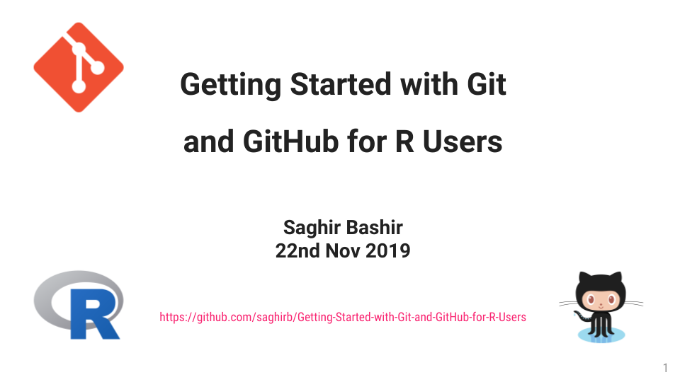

# Getting Started with Git and GitHub for R Users

Teach or learn how to work with Git, GitHub and RStudio for your R projects.

# Target Audience

+ R users who are new to Git and GitHub.

## Objectives

+ Motivations to use Git and GitHub
+ Setup an RStudio project with Git
    + Track your work
    + Keep a history of your files
+ Link your project to GitHub through RStudio

## Running the Workshop 

- Use the workshop presentation (HTML version):
    + https://github.com/saghirb/Getting-Started-with-Git-and-GitHub-for-R-Users/tree/master/Presentation
- Distribute the PDF version to participants:
    + https://github.com/saghirb/Getting-Started-with-Git-and-GitHub-for-R-Users/raw/master/Presentation/Getting-Started-with-Git-and-GitHub-for-R-Users.pdf

## Re-creating the Workshop Materials.

Run the [_make.R](https://github.com/saghirb/Getting-Started-with-Git-and-GitHub-for-R-Users/blob/master/_make.R) 
script in the R console.

## Workshops

1. Presented to [Centro de Estatística e Aplicações - CEAUL](http://ceaul.org/) at 
the [University of Lisbon](https://ciencias.ulisboa.pt/en). Support by [João Malato](https://github.com/jtmalato) and [Monica Eusébio](https://github.com/meusebio).
Thanks to Monica and João for doing a great job.

# Announcements

A reminder of announcements for this repository.

- CEAUL - internal announcement.

